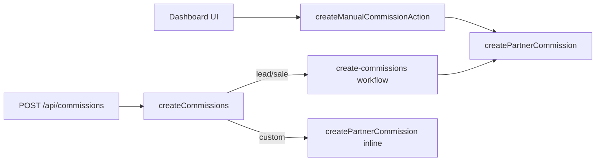

# Create Commissions Workflow — Business Logic Audit

Comparison of the legacy dashboard flow ([`create-manual-commission.ts`](../lib/actions/partners/create-manual-commission.ts)) with the new QStash workflow ([`create-commissions/route.ts`](<../app/(ee)/api/workflows/create-commissions/route.ts>)), triggered via [`create-commissions.ts`](../lib/api/commissions/create-commissions.ts) on `POST /api/commissions`.

**Last reviewed:** 2026-05-26 (after workflow fixes + team review)

## Architecture

| Path      | Entry                   | Custom commissions                                             |
| --------- | ----------------------- | -------------------------------------------------------------- |
| Dashboard | Server action           | Supported inline                                               |
| API       | `POST /api/commissions` | Inline in `createCommissions`; workflow rejects `type: custom` |

---

## Fixed since initial review

These gaps were present in the first workflow version and are **addressed** in the current route:

| #   | Issue                                                                                                          | Fix in workflow                                                                                                                                                                                              |
| --- | -------------------------------------------------------------------------------------------------------------- | ------------------------------------------------------------------------------------------------------------------------------------------------------------------------------------------------------------ |
| 1   | `link.saleAmount` / `customer.saleAmount` incremented by **commission earnings** instead of gross sale revenue | `totalSaleAmount` / `totalSales` now derived from `saleEvents` (`saleEvent.amount`), not `commission.earnings` ([`stepCreateCommissions`](<../app/(ee)/api/workflows/create-commissions/route.ts>) ~684–695) |
| 2   | Dub automation `saleAmount` metric used earnings                                                               | `stepExecuteWorkflow` passes `totalSaleAmount` from gross sale events                                                                                                                                        |
| 6   | No workspace check when resolving `customerId`                                                                 | `customer.projectId !== workspace.id` in `stepResolveCustomer` (~324–328)                                                                                                                                    |
| 12  | Lead event name mismatch (`"Sign Up"` vs `"Sign up"`)                                                          | Sale path uses `"Sign up"` (~426), aligned with legacy Stripe import                                                                                                                                         |
| —   | `executeWorkflows` / aggregate cron ran even when nothing created                                              | Gated on `commissions.length > 0` in `stepExecuteWorkflow` (~812–838)                                                                                                                                        |
| —   | No visibility on workflow failures                                                                             | `failureFunction` logs to Axiom (`workflow.failed`) (~212–237)                                                                                                                                               |

---

## Open issues

### Critical

#### O1 — Stripe import: Tinybird lead timestamp still wrong

**Legacy** (`useExistingEvents`): lead `timestamp` = first unimported invoice `createdAt`.

**Workflow** (`importStripeInvoices`): lead still uses `finalLeadEventDate` = `saleEventDate ?? new Date()` (~421–424, ~450–456), while sale events correctly use each invoice’s `createdAt`.

**Impact:** Tinybird lead analytics disagree with DB stats (workflow DB `lastLeadAt` is corrected from `saleEvents[0]` in `stepCreateCommissions`, so Prisma link stats can look right while Tinybird does not).

**Suggested fix:** After sorting invoices, set lead timestamp to `stripeCustomerInvoices[0].createdAt.toISOString()` (and align `finalLeadEventDate` / click `clickedAt` for that path), matching the manual action.

---

### Medium

p

#### O8 — `isFirstConversion` race

Still computed from `customer.sales` before stats increment (both paths). Concurrent imports can mis-count conversions.

**Suggested fix:** Document; optional conditional DB update if strict accuracy is required.

#### O9 — Double `executeWorkflows` triggers

Each `createPartnerCommission` still fires `partnerMetricsUpdated` with per-commission `earnings`; bulk step fires aggregate `leads` / `saleAmount` / `conversions`. Intentional parity with legacy; noisy for automation consumers.

---

### Low / operational

#### O10 — UI still uses server action, not workflow

Dashboard [`create-commission-sheet.tsx`](<../app/app.dub.co/(dashboard)/[slug]/(ee)/program/commissions/create-commission-sheet.tsx>) calls `createManualCommissionAction`. API consumers hit the workflow. Behavior diverges until UI migrates or logic is shared.

#### O11 — Custom commissions in workflow payload

Workflow permanently fails `type: custom` if mis-queued. API handles custom inline — OK.

#### O12 — QStash region

Workflow client uses `eu-central-1` in [`qstash-workflow.ts`](../lib/cron/qstash-workflow.ts). Confirm tokens/queues match deployment region.

---

## Accepted / intentional differences

Items reviewed and **not** treated as workflow bugs:

| ID     | Topic                                     | Decision                                                                                                                                                                                                                                                                                                                                                                       |
| ------ | ----------------------------------------- | ------------------------------------------------------------------------------------------------------------------------------------------------------------------------------------------------------------------------------------------------------------------------------------------------------------------------------------------------------------------------------ |
| ~~O2~~ | Stripe invoice batch cap (12)             | **Ignore.** Workflow may import more invoices than the legacy UI cap; no change planned.                                                                                                                                                                                                                                                                                       |
| ~~O3~~ | Optional `linkId` → highest-sales link    | **New API feature.** Intentional when `linkId` is omitted; not required for parity with dashboard.                                                                                                                                                                                                                                                                             |
| ~~O4~~ | Stats when every commission is skipped    | **By design.** Click/lead (and related) stats must still sync even when `createPartnerCommission` returns `null` (no reward, dedup, max duration, etc.).                                                                                                                                                                                                                       |
| ~~O5~~ | Sale without `saleAmount` / Stripe import | **Covered for API path.** Invalid sale payloads fail in the workflow at `stepCreateCommissions` (`No commissions to create`) before stats or downstream steps. API preflight in [`create-commissions.ts`](../lib/api/commissions/create-commissions.ts) covers invoice/Stripe checks; legacy UI action can still inflate click/lead stats without a sale (dashboard-only gap). |
| ~~O6~~ | Duplicate `invoiceId`                     | **OK.** Duplicate invoices fail at API enqueue (`DubApiError`); workflow DB unique constraint is a safety net.                                                                                                                                                                                                                                                                 |
| ~~O7~~ | Customer upsert `update: {}`              | **Ignore.** Existing customers keyed by `projectId_externalId` are not merged on update.                                                                                                                                                                                                                                                                                       |

---

## Parity checklist (quick reference)

| Behavior                              | Manual action            | Workflow (current)      |
| ------------------------------------- | ------------------------ | ----------------------- |
| Gross `saleAmount` on link/customer   | Yes (`saleEvent.amount`) | Yes                     |
| Customer workspace scope              | Yes                      | Yes                     |
| Stripe invoice max 12                 | Yes (UI only)            | No cap (intentional)    |
| Stripe lead TB timestamp              | First invoice            | **saleEventDate / now** |
| `linkId` required                     | Yes (UI)                 | Optional (API default)  |
| Stats when zero commissions created   | Yes (events recorded)    | Yes (intentional)       |
| Fail if sale w/o amount               | No (UI stats inflate)    | Yes (API fail-fast)     |
| `executeWorkflows` if zero created    | Yes (still runs)         | No (gated)              |
| Custom commission                     | Yes                      | N/A (API inline)        |
| Transaction for link + customer stats | `allSettled`             | `$transaction`          |

---

## Recommended fix order

1. **P0:** O1 (Stripe lead Tinybird timestamp)
2. **P1:** O8–O9 (document races / automation noise if needed)
3. **P2:** O10 (UI/API unification when ready)
4. **P3:** O12 (QStash region alignment)

---

## Files

- Workflow: [`apps/web/app/(ee)/api/workflows/create-commissions/route.ts`](<../app/(ee)/api/workflows/create-commissions/route.ts>)
- API enqueue: [`apps/web/lib/api/commissions/create-commissions.ts`](../lib/api/commissions/create-commissions.ts)
- Legacy UI: [`apps/web/lib/actions/partners/create-manual-commission.ts`](../lib/actions/partners/create-manual-commission.ts)
- Shared commission logic: [`apps/web/lib/partners/create-partner-commission.ts`](../lib/partners/create-partner-commission.ts)
